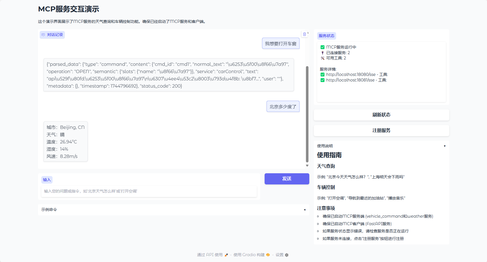

# MCP Web 演示

这是一个基于Gradio的MCP服务交互演示界面，提供了一个简单的图形用户界面，用于与MCP服务进行交互。

## 目前功能

- 天气查询：可以查询不同城市的天气信息
- 车辆控制：可以发送车辆控制指令
- 服务状态监控：实时显示MCP服务的状态信息
- 示例命令：提供了一些示例命令以便快速开始


## 使用方法

### 1. 启动MCP服务

在运行web演示之前，确保已启动以下服务：

1. 车控服务（端口18080）
   ```bash
   command_server.py
   ```

2. 天气服务（端口18081）
   ```bash
     weather_server.py
   ```

3. 启动MCP客户端（FastAPI服务，端口8000）
   ```bash
    n main.py
   ```

### 2. 启动Web演示

确保所有服务都已启动后，运行web演示：

```bash
  web_demo.py
```

演示界面将在 http://127.0.0.1:7860 上运行。

## 使用示例
[]